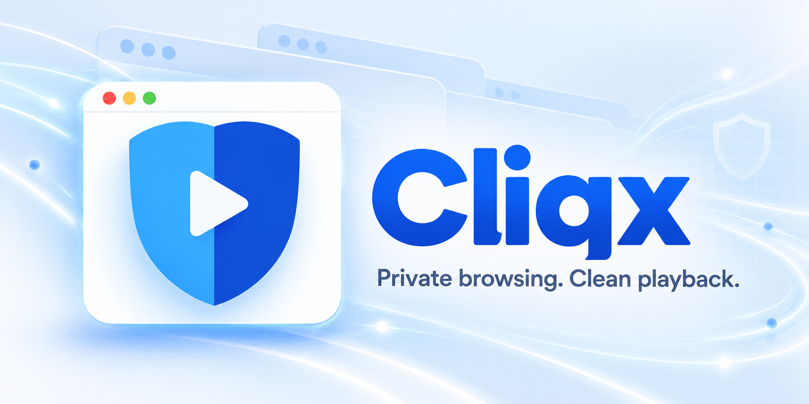
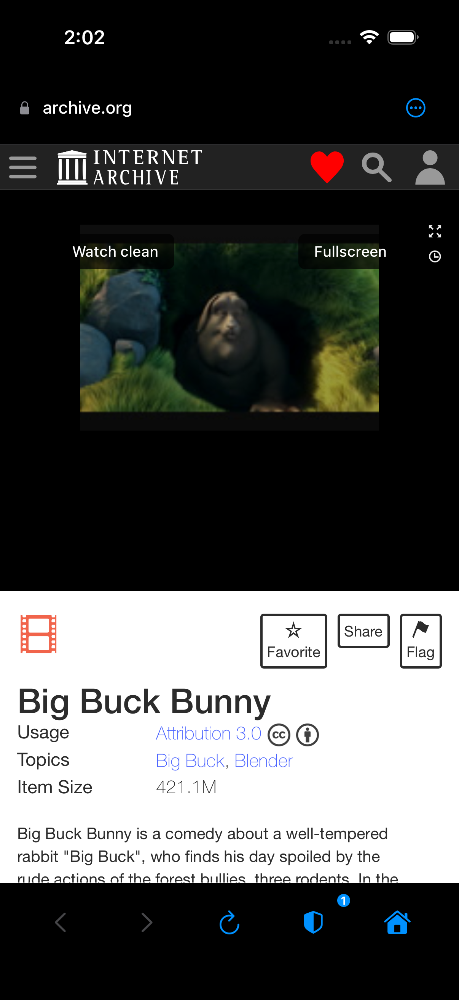
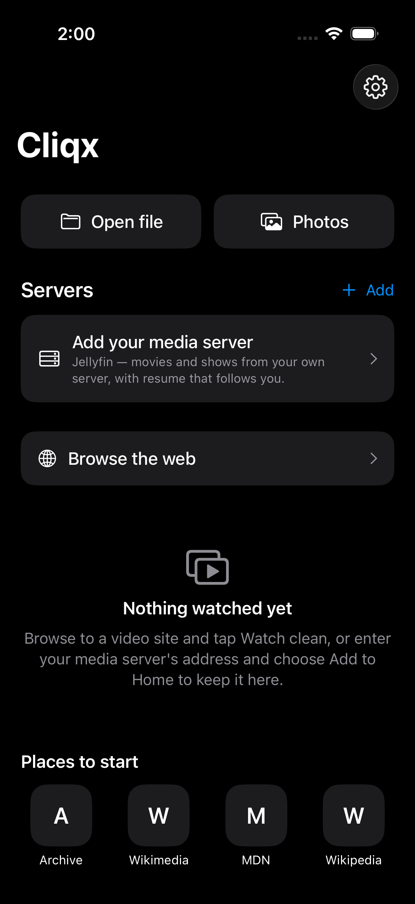
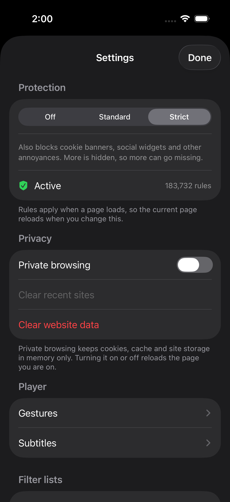
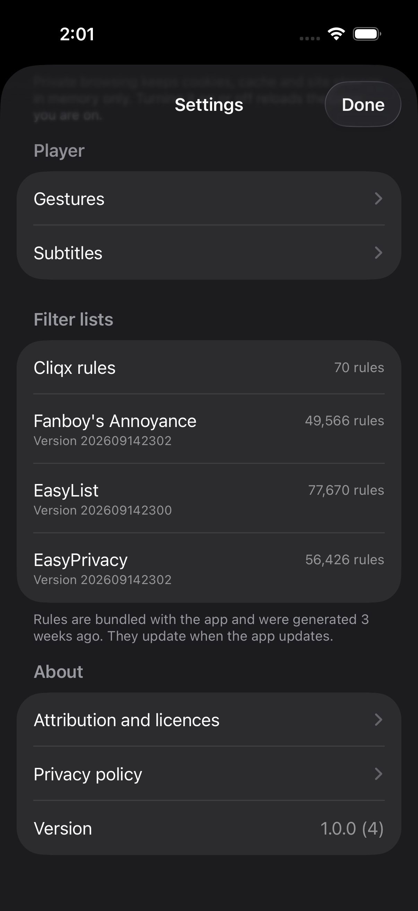

<div align="center">



<h1>Cliqx</h1>

<p><strong>An iOS browser for watching video.</strong><br>
Blocks the ads, kills the popups, strips the overlays — then hands the stream to a native player.</p>

[](https://github.com/SaiSamardh7/cliqx/actions/workflows/ci.yml)
[](#verification)
[](#how-it-blocks)
[](#requirements)
[](LICENSE)
[](PRIVACY.md)

<p>
<a href="#what-it-does">What it does</a> ·
<a href="#how-it-blocks">How it blocks</a> ·
<a href="#verification">Verification</a> ·
<a href="ARCHITECTURE.md">Architecture</a> ·
<a href="docs/BUILDING.md">Build it</a> ·
<a href="docs/ROADMAP.md">Roadmap</a> ·
<a href="CHANGELOG.md">Changelog</a> ·
<a href="PRIVACY.md">Privacy</a>
</p>

</div>

---

## The problem

Watching a video on the open web means losing an argument with the page first.
A preroll you cannot skip. Three popups from a click that was aimed at the play
button. A translucent overlay that eats the next tap. A player that will not go
full screen because the page wants you to see the banner next to it.

Cliqx is a browser that loses that argument on your behalf, before the page
finishes loading.

## What it does

| | |
|---|---|
| **Blocks at the network layer** | 183,732 compiled WebKit content rules across four lists — ads, tracking, annoyances — covering ~104,000 distinct domains. Requests never leave the device. |
| **Cancels popups before they open** | New-window attempts are refused at the navigation-policy layer, not closed after the fact. |
| **Strips overlays** | A geometry heuristic finds the transparent elements sitting on top of the player and removes them, including on pages that host no video of their own. |
| **Watch clean** | When a page exposes a playable stream, it opens in a native player: Picture in Picture, AirPlay, subtitles, and next/previous episode navigation. |
| **Plays your own media** | Local files from Files, or a [Jellyfin](https://jellyfin.org) server you run yourself. Cliqx hosts nothing and provides no content. |
| **Talks to no one** | No account, no backend, no analytics, no tracking SDK, no crash reporter. Filter lists ship inside the binary; the app makes no network request of its own. |

> [!NOTE]
> **iOS only, and that is architectural, not a backlog item.** The whole approach
> is built on `WKContentWorld`, `WKContentRuleList` and `webkitEnterFullscreen`.
> There is no Android, web or desktop version — not planned, not in progress.

## Screens

<div align="center">

<table>
<tr>
<td align="center" width="50%">
<br>
<sub><b>Watch clean</b>, offered over the page's own player.<br>The shield in the toolbar carries the blocked count.</sub>
</td>
<td align="center" width="50%">
<br>
<sub><b>Home.</b> Local files, your own server,<br>or the open web.</sub>
</td>
</tr>
<tr>
<td align="center" width="50%">
<br>
<sub><b>Off / Standard / Strict.</b> Strict is a real<br>superset, and says how many rules are live.</sub>
</td>
<td align="center" width="50%">
<br>
<sub><b>Every list, counted and dated.</b> These<br>numbers are read from the shipped manifest.</sub>
</td>
</tr>
</table>

<sub>Captured on iPhone 17 Pro, iOS 26.2. The film is <a href="https://archive.org/details/BigBuckBunny_124">Big Buck Bunny</a> (Blender Foundation, CC BY 3.0).</sub>

</div>

## Requirements

- iOS 17 or later (iPhone and iPad)
- Xcode 26.2 to build it yourself — see [`docs/BUILDING.md`](docs/BUILDING.md)

## Status

**v1.0.0, pre-release. Not on the App Store yet.**

The engineering is done and covered by tests. App identity, icon, signing,
privacy declarations and the store listing are all settled. What is left is
screenshots, a pass on real hardware, and one measurement nobody has taken:

> There is no success rate for "Watch clean", because nobody has run it against
> ten real sites and written down what happened. Until that exists, any quality
> claim is a guess.

[`docs/ROADMAP.md`](docs/ROADMAP.md) has the rest, grouped by **who can unblock
it** rather than by priority. [`docs/FIX-LIST.md`](docs/FIX-LIST.md) ranks
everything by severity; S1 is closed.

## How it blocks

Four compiled content-rule lists, chosen at three levels:

| Level | Rules | Lists |
|---|---|---|
| Off | 0 | — |
| Standard | 134,166 | ads, privacy |
| Strict | **183,732** | ads, privacy, annoyances, + unbreak |

The rules are generated at build time by a Rust converter
([`tools/`](tools/)) that downloads EasyList, EasyPrivacy and Fanboy's
Annoyance, converts ABP syntax to WebKit content-blocker JSON, compresses it,
and rewrites a manifest. Brave's 944 compatibility exceptions are folded into
the *same* `FilterSet` as the rules they undo, because WebKit applies
`ignore-previous-rules` only within the list that contains it — a separate
unbreak list cancels nothing at all. There is a test named
`testWhetherIgnorePreviousRulesReachesAcrossLists` that exists because this was
learned the hard way.

```bash
./tools/convert-filters.sh      # needs a Rust toolchain
```

The manifest's `generatedSha256` keys WebKit's compiled-list cache, so it must
match the shipped payload. CI checks it, and so does the Swift suite.

See [`docs/FILTER-ENGINE.md`](docs/FILTER-ENGINE.md) for the engine and licence
assessment, and why each list was picked.

## Verification

**695** — 248 Swift · 11 UI · 436 agent (218 specs, two engines). All green in
CI, on every push and every pull request.

| Suite | Runs on | Why it is there |
|---|---|---|
| Swift unit | iOS Simulator | The rules, the bridge, the heuristics |
| UI | iOS Simulator | The screens, end to end |
| Page agent | Chromium **and** WebKit | The injected agent, against hostile fixtures |

WebKit is not optional in that matrix. Mode B is built on
`webkitEnterFullscreen`, which Chromium does not have, so a Chromium-only run
proves nothing about the thing that ships.

Those counts are not hand-maintained. `tools/count-tests.py --check` fails CI
when this file and the suites disagree, because they disagreed here for two
weeks. The rule counts above are checked the same way by
`tools/count-rules.py --check`, after four documents stated three different
numbers for a bundle that held one.

```bash
# Swift + UI
cd ios && xcodebuild test -scheme CleanPlayer \
  -destination 'platform=iOS Simulator,name=iPhone 17 Pro'

# Page agent, both engines
npm ci && npx playwright install chromium webkit && npx playwright test
```

> [!WARNING]
> **`swift test` does not work, and cannot.** `Package.swift` declares
> `.iOS(.v17)` only and the sources use iOS-only WebKit and CryptoKit APIs, so a
> host build fails to compile. An iOS Simulator destination is the only option.

## Privacy

Every category on Apple's privacy questionnaire is answered **"Data Not
Collected"**, and that answer is defensible from the architecture rather than
from a promise:

- No advertising, analytics or tracking SDK is linked.
- No `NSUserTrackingUsageDescription`, because nothing tracks.
- Recents live in `UserDefaults` on the device. There is no server to send them to.
- MetricKit payloads and Watch Clean outcome counts stay local and are never uploaded.
- The app makes no network request of its own. Every request originates from a
  page you navigated to.

Full policy in [`PRIVACY.md`](PRIVACY.md); the submission notes and the
reviewer-checkable facts are in [`docs/APP-STORE.md`](docs/APP-STORE.md).

## Layout

```
ios/Sources/CleanPlayer/   Swift package — rules, settings, WebKit setup
ios/Tests/                 XCTest suite
ios/App/                   The app target (Xcode project)
tests/                     Playwright suite for the injected page agent
tools/                     Build-time filter converter (Rust) + CI checks
docs/                      Roadmap, fix list, filter-engine and store notes
```

`ARCHITECTURE.md` is the long read: how it works, why each mode exists, and the
three heuristics that were wrong before they were right.

## Contributing

Issues and pull requests are welcome — [`CONTRIBUTING.md`](CONTRIBUTING.md) has
the ground rules, including the one that matters most: the test counts in this
README are enforced by CI, so adding tests means updating them.

Security reports go through [`SECURITY.md`](SECURITY.md), not the public issue
tracker.

## Licence

[MIT](LICENSE) for the code.

The generated filter-rule data under `ios/App/CleanPlayerApp/Resources/rules/`
is a derived work of EasyList and is offered under **CC BY-SA 3.0** instead.
[`NOTICE.md`](NOTICE.md) sets out that split and the attribution it requires,
along with VLCKit — the one third-party library linked, which decodes the video.
